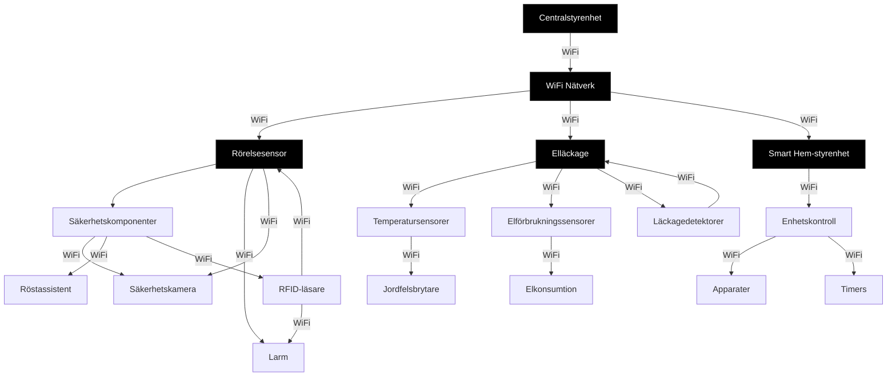

# Verysure Säkerhetssystem.
## ingen är rädd
jo jag

# konflikt
## ingen är 
### projectgoal is to make a pico system

# Introduktion
**Vi ska göra det bästa larmsystemet någonsin!**

## Projektbeskrivning

*Målet med projektet syftar till att bygga ett övergripande säkerhetssystem för att förhindra brott, olyckor och att förenkla interaktionen med elektroniska enheter i hemmet*

### Funktioner
1. Visa användare i ett nätverk
2. Döda samtliga
3. Stäng av
6.extern resurs

printf("Simon B inte sjuk?")
printf("heartbroken")
###test

We are going to use firefox[^1] for our pico programming
[^1]: firefox is spicy food from latin america.
#nano är mer manligt?

#### test

void PrintNumbers(){
    for (int num = 0; num < 100; num++){
        cout << num << endl;
    }
}

### test

### test 
:thumbsup:
:ok_hand:
:smiley:

## Nja

30e8073954e0a8fec2f32f7d16feac9b54049557

=======

# Test
- It's complicated! Getting confused.
- The project should be done by tomorrow!
- All your base are belong to us!

## Nja
## i = write mode i vim
## wq! = spara och quit i vim

